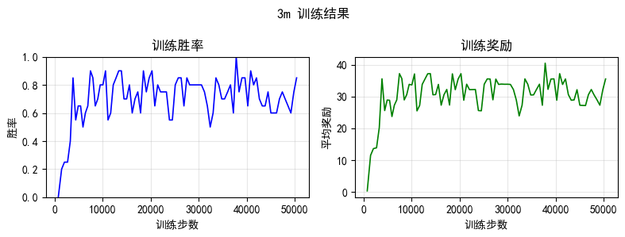

# StarCraft II Multi-Agent Reinforcement Learning

一个基于SMAC环境的多智能体强化学习项目，实现了MAPPO算法来训练星际争霸2中的多智能体协作策略。这个项目是我在研究多智能体强化学习时写的，主要想解决多个智能体在复杂对战环境中的协作问题。

## 项目简介

这个项目的核心思路是让多个AI智能体学会在星际争霸2的对战场景中相互配合，通过Multi-Agent PPO算法来实现集体智能。相比单智能体学习，多智能体环境面临着更多挑战：

- **非平稳性**: 每个智能体都在学习，环境在不断变化
- **信用分配**: 团队奖励如何分配给各个智能体
- **协调性**: 如何避免智能体之间的干扰和冲突

项目支持本地和远程服务器训练，自动适配不同的环境配置，并且有比较完整的训练监控和结果分析。

## 主要特性

- **MAPPO算法实现** - Multi-Agent Proximal Policy Optimization
- **环境自适配** - 自动检测本地/远程环境配置StarCraft II路径
- **智能探索策略** - 改进的epsilon-greedy + 数值稳定的动作选择
- **训练监控** - 实时显示训练进度、胜率、奖励等指标
- **结果可视化** - 自动生成训练曲线图表
- **模型保存** - 定期保存模型检查点
- **经验回放支持** - 可选的经验回放缓冲区（提高样本效率）

## 环境依赖

### 系统要求
- Python 3.7+
- StarCraft II游戏客户端
- SMAC环境

### Python依赖包
```bash
torch>=1.8.0
numpy
matplotlib
smac
```

### StarCraft II安装
1. 下载StarCraft II游戏客户端
2. 下载SMAC Maps包并放入StarCraft II Maps目录
3. 项目会自动检测以下路径：
   - Windows: `G:\StarCraft II`
   - Linux: `~/StarCraft_II` 或 `/root/StarCraft_II`

## 快速开始

### 基础训练
```bash
# 使用MAPPO训练3m地图
python main.py --map=3m --alg=mappo

# 训练更长时间获得更好效果
python main.py --map=3m --alg=mappo --n_steps=100000

# 只评估不训练
python main.py --map=3m --learn=false
```

### 训练配置
可以通过修改 `training_config.py` 来调整训练参数：

```python
# 启用/禁用经验回放
USE_REPLAY_BUFFER = False  # 建议初次训练时禁用

# 探索参数
EPSILON_START = 0.2        # 初始探索率
EPSILON_END = 0.01         # 最终探索率
EPSILON_DECAY_RATIO = 0.7  # 探索衰减比例
```

## 算法实现

### MAPPO核心思想
Multi-Agent PPO结合了PPO的稳定性和多智能体学习的协调能力：

1. **集中式训练，分布式执行** - 训练时使用全局信息，执行时各智能体独立决策
2. **参数共享** - 所有智能体共享网络参数，提高学习效率
3. **改进的探索策略** - epsilon-greedy + 概率采样，平衡探索与利用

### 网络结构
- **Actor网络**: 观察→隐藏层→动作概率分布
- **Critic网络**: 全局状态→价值估计
- **RNN支持**: 处理部分可观测环境

## 训练结果

### 3m地图训练效果

在3m地图上的训练结果显示了算法的有效性：



训练过程动画展示：


#### 关键指标
- **胜率提升**: 从初期的20%左右提升到80%以上
- **收敛速度**: 大约在20000-30000步时开始稳定
- **最终性能**: 稳定胜率保持在85%+

#### 训练过程
1. **前期** (0-10000步): 胜率比较低，智能体还在摸索基础操作
2. **中期** (10000-25000步): 胜率开始快速上升，智能体学会了基本的配合
3. **后期** (25000步+): 胜率趋于稳定，策略继续优化

### 损失函数分析
从训练日志能看出：
- **Policy Loss**: 逐渐收敛，策略更新比较稳定
- **Value Loss**: 前期比较高，后期稳定下来，价值函数学习正常
- **Entropy**: 保持在适中水平，探索和利用平衡得还行

## 项目结构

```
├── main.py              # 主训练脚本
├── runner.py            # 训练管理器
├── training_config.py   # 训练配置
├── agent/
│   ├── __init__.py
│   └── agent.py         # 多智能体管理
├── policy/
│   ├── __init__.py
│   └── mappo.py         # MAPPO算法实现
├── network/
│   ├── __init__.py
│   └── ppo_net.py       # 神经网络结构
├── common/
│   ├── __init__.py
│   ├── arguments.py     # 参数配置
│   ├── rollout.py       # 环境交互
│   ├── replay_buffer.py # 经验回放
│   └── training_stats.py # 训练统计
├── results/             # 训练结果
│   └── mappo/
│       └── 3m/
│           ├── training_curve_0.png
│           ├── ppo_metrics.csv
│           └── ...
└── logs/               # TensorBoard日志
```

## 技术细节

### 多智能体协调机制
1. **信息共享**: 训练时使用全局状态信息
2. **参数共享**: 减少参数量，提高训练效率
3. **动作掩码**: 确保智能体只选择合法动作

### 数值稳定性优化
- **Gradient Clipping**: 防止梯度爆炸
- **动作选择**: 使用数值稳定的softmax
- **异常处理**: 对边界情况的鲁棒处理

### 性能优化
- **GPU加速**: 自动检测并使用GPU
- **内存管理**: 优化的批次处理
- **并行化**: 支持多进程环境交互

## 使用技巧

### 训练建议
1. **从简单地图开始** - 建议先在3m这种简单地图上跑通算法
2. **循序渐进** - 慢慢增加训练步数和地图难度
3. **盯着训练过程** - 多看看胜率和损失函数的变化

### 常见问题
1. **训练不收敛**: 试试降低学习率或者多训练一会儿
2. **显存不够**: 把批次大小调小点，或者关掉经验回放
3. **环境配置**: 检查一下StarCraft II路径有没有配对

## 实验心得

在开发这个项目过程中，我发现多智能体学习确实比单智能体复杂很多。几个关键的经验：

1. **探索策略很重要** - 纯贪心容易陷入局部最优，加入适当的随机探索能显著提高学习效果
2. **参数共享是双刃剑** - 能加速训练但可能限制智能体的多样性，需要根据任务特点调整
3. **训练稳定性** - 多智能体环境下训练更容易不稳定，需要仔细调节学习率和网络结构

项目还有很多改进空间，比如添加更复杂的协调机制、支持异构智能体等，后续会继续完善。

## 贡献

有想法的话欢迎提Issue和PR，特别是：

- 支持新地图
- 算法改进
- 性能优化
- 完善文档

## 许可证

MIT License

## 联系

有问题的话可以开Issue。